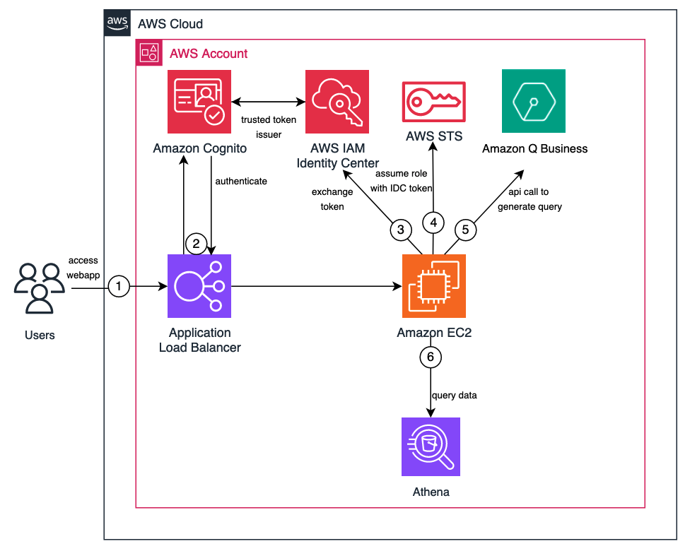
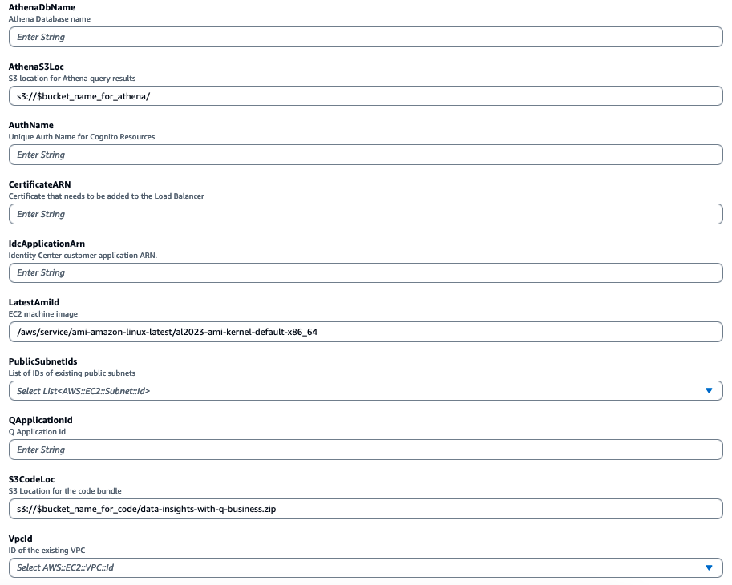
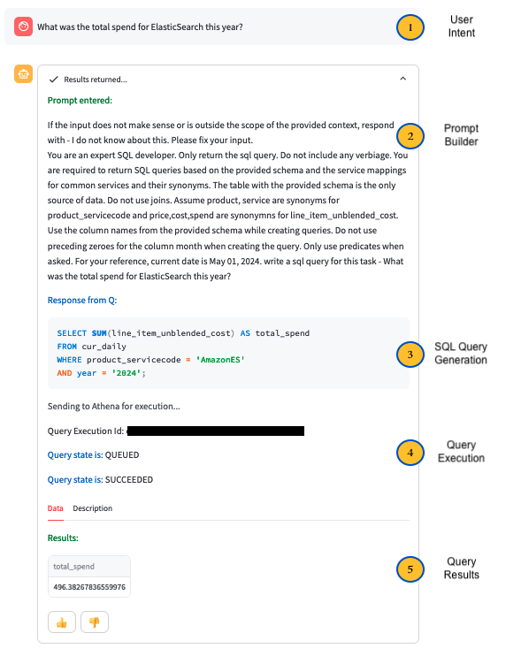

# Data Insights with Amazon Q Business
## Introduction
Query any structured data with Natural Language Understanding using Amazon Q Business. In this example, we'll look at an architecture to query structured data using Amazon Q Business, and build out an application to query cost and usage data in Amazon Athena with Amazon Q Business. Q Business can be used create SQL queries to your datasources when provided with the database schema, additional metadata describing the columns and tables, and prompting instructions. This architecture can be extended to use additional data sources, query validation and prompting techniques to cover a wider range of use cases.

## Architecture



The workflow includes the following steps:
1.	First the user accesses the chatbot application, which is hosted behind an Application Load Balancer.

2.	The user is prompted to log with Cognito

3.  The application exchanges the token from Cognito with an IAM Identity Center token with the scope for Amazon Q Business

4.  The application assumes an IAM role and retrieves an AWS Session from Secure Token Service (STS), augmented with the IAM Identity Center token to interact with Amazon Q Business

5.  The application calls the chat_sync api of Amazon Q Business with relevant prompt and metadata based on the natural language query. Amazon Q Business responds back with relevant Athena query to be run

6.  The query is run against Athena and results displayed on the webapp

## Prerequisites
- You need to set up [AWS Identity Center](https://docs.aws.amazon.com/singlesignon/latest/userguide/get-set-up-for-idc.html) and [add users](https://docs.aws.amazon.com/singlesignon/latest/userguide/addusers.html) that you intend to give access to in your Q Business application.
- An existing, working [Amazon Q Business application](https://docs.aws.amazon.com/amazonq/latest/qbusiness-ug/quick-create-app.html) and [give access](https://docs.aws.amazon.com/amazonq/latest/qbusiness-ug/quick-create-add-users.html) to the users created in the previous step to the application.
- [CUR data](https://docs.aws.amazon.com/cur/latest/userguide/what-is-cur.html) is available in Athena. If you have CUR data, you can skip the below steps for CUR data setup. If not, you've a few options to set up CUR data:
    - To set up sample CUR data, Go to [this lab](https://catalog.us-east-1.prod.workshops.aws/workshops/b34be2fe-d667-4354-9600-b41f6a38c745/en-US/step-1-setting-up-cost-and-usage-reports/step-1a-pre-provided-training-cur-data) and follow the instructions.
    - You'll also need to set up a [Glue Crawler](https://catalog.us-east-1.prod.workshops.aws/workshops/b34be2fe-d667-4354-9600-b41f6a38c745/en-US/step-2-aws-glue) to make the data available in Athena.
- If you already have an SSL certificate, you can skip this step otherwise [Generate a private certificate](https://github.com/aws-samples/custom-web-experience-with-amazon-q-business?tab=readme-ov-file#generate-private-certificate)
- Import the certificate into AWS Certificate Manager (ACM). For more details, [refer to Importing a certificate](https://docs.aws.amazon.com/acm/latest/userguide/import-certificate-api-cli.html).

## 🚀 Deploy this Solution:
### Step 1: Clone the git repo
```
git clone https://github.com/aws-samples/data-insights-with-amazon-q-business.git
```
- Review the table name under **_app/schemas/cur_schema.txt_**. It should match the table name you created in the CUR data setup steps. By default, the table name is **_customer_all_**. You can also modify the schema/table name per your data.
- Also, Review the prompts under **_app/qb_config.py_** . For the demo, zip up the code repository and upload it to a S3 bucket. You can also modify the prompts based on your test results later.

### Step 2: Launch the [AWS CloudFormation template](Cloudformation.yaml) to deploy ELB , Cognito User pool , including the EC2 instance to host the webapp.
⚙️ Provide the following parameters for stack

•	**Stack name** – The name of the CloudFormation stack (for example, AmazonQ-Data-Insights-Demo)

•   **AthenaDbName** - Athena database name where the CUR table resides

•   **AthenaS3Loc** - S3 location for Athena output

•	**AuthName** – A globally unique name to assign to the Amazon Cognito user pool

•	**CertificateARN** – The CertificateARN generated from the previous step

•	**IdcApplicationArn** – Identity Center customer application ARN , **keep it blank on first run** as we need to create the cognito user pool as part of this stack to create [IAM Identity Center application with a trusted token issuer](https://docs.aws.amazon.com/singlesignon/latest/userguide/using-apps-with-trusted-token-issuer.html)

•	**PublicSubnetIds** – **Use atleast two**. The IDs of the public subnets that can be used to deploy the EC2 instance and the Application Load Balancer

•	**QApplicationId** – The existing application ID of Amazon Q

•   **S3CodeLoc** - Full S3 location of the code zip file

•	**VPCId** – The ID of the existing VPC that can be used to deploy the demo




### Once the stack is complete, copy the following keys from the Output tab .

**Audience** : Audience to setup customer application in Identity Center

**RoleArn** : ARN of the IAM role required to setup token exchange in Identity Center

**TrustedIssuerUrl** : Endpoint of the trusted issuer to setup Identity Center

**URL** : The Load balancer URL to access the streamlit app

### Next Steps : To proceed further, you need to follow steps 2-6 listed in [this solution](https://github.com/aws-samples/custom-web-experience-with-amazon-q-business?tab=readme-ov-file#step-2-create-an-iam-identity-center-application) to deploy the webapp

## Login
You can now login to the app using your credentials.


### Examples
The end to end workflow has 5 major steps -
1. User Intent - Natural Language Query
2. Prompt Builder - Open domain prompt for Q Business along with table schema and metadata info
3. Amazon Q Business generates the query
4. Query is run against Athena
5. Results are displayed on the webapp.

### Note that the sample data set is from year 2023. Natural language queries referring to _current year_ will give not return results.



### Here're some more sample natural language queries that you can now run

````
- what were the top 3 services by spend last year
- Total spend for ES for each month of 1st quarter of last year
- Give me a list of the top 3 products by total spend last year. For each of these products, what percentage of the overall spend is from this product?
- what all sagemaker instance types i used last year and what was their cost
````

## Clean-up
Delete the cloud formation stack, Q Business Application and Athena tables.

## Security

See [CONTRIBUTING](CONTRIBUTING.md#security-issue-notifications) for more information.

## License

This library is licensed under the MIT-0 License. See the LICENSE file.

